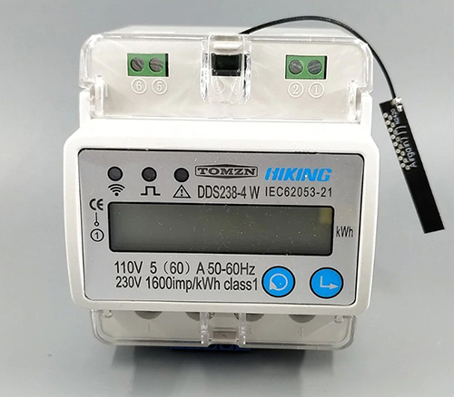
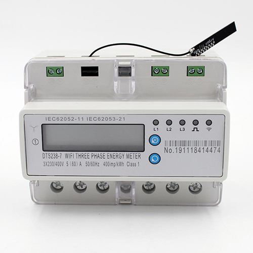
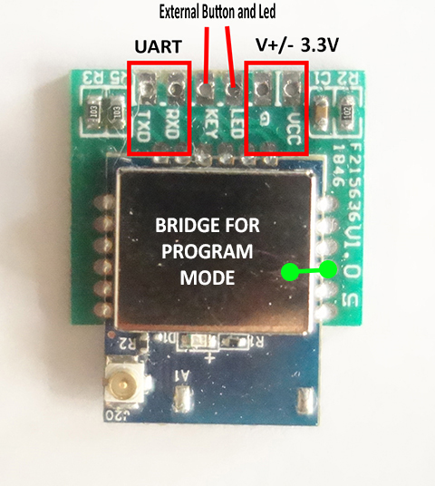

# DDS238-4 W and DTS238-7 W Wifi Energy Meters

The `dxs238xw` component allows full use of all the functions of the DDS238-4 W and DTS238-7 W Wifi energy meters. The `dxs238xw` component together with ESPHome is a good replacement for the original firmware of these meters and allows a perfect integration with Home Assistant.

The installation of this component in your energy meter necessarily requires opening the meter, desoldering the ESP8266 module and installing the new firmware. Then solder the ESP8266 module again and test its operation.

Subsequent updates no longer require disarming the energy meter again, as they are done over OTA.

Because it is necessary to desolder the ESP8266 module, minimal knowledge of electronics is required.

It is convenient before installing the new firmware, make a backup copy of the original firmware.

This development works only with the meters that work with the WISEN app on android. If your meter is TUYA, this solution is not for you.





```yaml
    #------------------------------------------------------------------------
    # Common setting for the 1 and 3 Phase Meter (DDS238-4 W and DTS238-7 W).
    # All possible entities are shown, but the idea
    # is to only place the ones that are going to be used.
    #------------------------------------------------------------------------

    logger:
      level: DEBUG
      baud_rate: 0

    uart:
      tx_pin: 1
      rx_pin: 3
      baud_rate: 9600

    dxs238xw:
      update_interval: 3s

    sensor:
      - platform: dxs238xw
        frequency:
          name: "Frequency"

        import_active_energy:
          name: "Import Active Energy"
        export_active_energy:
          name: "Export Active Energy"
        total_energy:
          name: "Total Energy"

        energy_purchase_balance:
          name: "Energy Purchase - Balance"

        phase_count:
          name: "Phases N°"

        energy_purchase_price:
          name: "Energy Purchase Price"

        total_energy_price:
          name: "Total Energy Price"
        contract_total_energy:
          name: "Total Energy Contract"

    text_sensor:
      - platform: dxs238xw
        meter_state_detail:
          name: "State - Detail"
          filters:
            - substitute:
              - "Off by Over Voltage -> INACTIVE - Over Voltage"
              - "Off by Under Voltage -> INACTIVE - Under Voltage"
              - "Off by Over Current -> INACTIVE - Over Current"
              - "Off by End Purchase -> INACTIVE - End Purchase"
              - "Off by End Delay -> INACTIVE - End Delay"
              - "Off by User -> INACTIVE - By User"
              - "Off by Unknown -> INACTIVE - Unknown"
              - "Power Ok -> ACTIVE"
        delay_value_remaining:
          name: "Remaining Delay Time"
        meter_id:
          name: "Serial N°"

    number:
      - platform: dxs238xw
        max_current_limit:
          name: "Maximum Current"
        max_voltage_limit:
          name: "Maximum Voltage"
        min_voltage_limit:
          name: "Minimum Voltage"
        energy_purchase_value:
          name: "Energy Purchase"
        energy_purchase_alarm:
          name: "Energy Purchase Alarm"
        delay_value_set:
          name: "Delay Time"
        starting_kWh:
          name: "kWh Start"
        price_kWh:
          name: "kWh Price"

    switch:
      - platform: dxs238xw
        energy_purchase_state:
          name: "Activate Energy Purchase"
        meter_state:
          name: "State SmartMeter"
        delay_state:
          name: "Activate Delay"

    button:
      - platform: dxs238xw
        reset_data:
          name: "Restart Consumption"
      - platform: restart
        name: "Restart Device"

    binary_sensor:
      - platform: gpio
        internal: true
        id: button_0
        pin:
          number: GPIO13
          mode:
            input: true
            pullup: true
          inverted: true
        on_multi_click:
        - timing:
            - ON for at least 1s
          then:
            - dxs238xw.meter_state_toggle
          invalid_cooldown: 0ms

      - platform: dxs238xw
        warning_off_by_over_voltage:
          name: "Over Voltage Alert"
        warning_off_by_under_voltage:
          name: "Under Voltage Alert"
        warning_off_by_over_current:
          name: "Over Current Alert"
        warning_off_by_end_purchase:
          name: "End Purchase Alert"
        warning_off_by_end_delay:
          name: "End Delay Alert"
        warning_off_by_user:
          name: "Off by User Alert"
        warning_purchase_alarm:
          name: "Balance Purchase Alert"
        meter_state:
          name: "Relay State"

    status_led:
      pin:
        number: GPIO14
        inverted: no
```

```yaml
    #----------------------------------------------------
    # This setting is for the 1 Phase Meter (DDS238-4 W).
    # All possible entities are shown, but the idea
    # is to only place the ones that are going to be used.
    #----------------------------------------------------

    sensor:
      - platform: dxs238xw
        current_phase_1:
          name: "Current"
          
        voltage_phase_1:
          name: "Voltage"
          
        reactive_power_phase_1:
          name: "Reactive Power"
          
        active_power_phase_1:
          name: "Active Power"
          
        power_factor_phase_1:
          name: "Power Factor"
```

```yaml
    #----------------------------------------------------
    # This setting is for the 3 Phase Meter (DTS238-7 W).
    # All possible entities are shown, but the idea
    # is to only place the ones that are going to be used.
    #----------------------------------------------------

    sensor:
      - platform: dxs238xw
        current_phase_1:
          name: "Current Phase 1"
        current_phase_2:
          name: "Current Phase 2"
        current_phase_3:
          name: "Current Phase 3"

        voltage_phase_1:
          name: "Voltage Phase 1"
        voltage_phase_2:
          name: "Voltage Phase 2"
        voltage_phase_3:
          name: "Voltage Phase 3"

        reactive_power_phase_1:
          name: "Reactive Power Phase 1"
        reactive_power_phase_2:
          name: "Reactive Power Phase 2"
        reactive_power_phase_3:
          name: "Reactive Power Phase 3"
        reactive_power_total:
          name: "Reactive Power Total"

        active_power_phase_1:
          name: "Active Power Phase 1"
        active_power_phase_2:
          name: "Active Power Phase 2"
        active_power_phase_3:
          name: "Active Power Phase 3"
        active_power_total:
          name: "Active Power Total"

        power_factor_phase_1:
          name: "Power Factor Phase 1"
        power_factor_phase_2:
          name: "Power Factor Phase 2"
        power_factor_phase_3:
          name: "Power Factor Phase 3"
        power_factor_total:
          name: "Power Factor Total"
```

# Global Component Settings

## Configuration variables:

- **update_interval** (*Optional*, [Time](https://esphome.io/guides/configuration-types.html)): Delay between data requests, minimum 3s.

# Sensor

Sensors entities to show data, includes the measurements generated by the energy meter.

## Configuration variables:

- **voltage_phase_1** (*Optional*): Voltage measurement by the meter, phase 1.
- **voltage_phase_2** (*Optional*): Voltage measurement by the meter, phase 2.
- **voltage_phase_3** (*Optional*): Voltage measurement by the meter, phase 3.
- **current_phase_1** (*Optional*): Current measurement by the meter, phase 1.
- **current_phase_2** (*Optional*): Current measurement by the meter, phase 2.
- **current_phase_3** (*Optional*): Current measurement by the meter, phase 3.
- **frequency** (*Optional*): Frequency measurement by the meter.
- **reactive_power_phase_1** (*Optional*): Reactive Power measurement by the meter, phase 1.
- **reactive_power_phase_2** (*Optional*): Reactive Power measurement by the meter, phase 2.
- **reactive_power_phase_3** (*Optional*): Reactive Power measurement by the meter, phase 3.
- **reactive_power_total** (*Optional*): Total Reactive Power measurement by the meter, for all phases.
- **active_power_phase_1** (*Optional*): Active Power measurement by the meter, phase 1.
- **active_power_phase_2** (*Optional*): Active Power measurement by the meter, phase 2.
- **active_power_phase_3** (*Optional*): Active Power measurement by the meter, phase 3.
- **active_power_total** (*Optional*): Total Active Power measurement by the meter, for all phases.
- **power_factor_phase_1** (*Optional*): Power Factor measurement by the meter, phase 1.
- **power_factor_phase_2** (*Optional*): Power Factor measurement by the meter, phase 2.
- **power_factor_phase_3** (*Optional*): Power Factor measurement by the meter, phase 3.
- **power_factor_total** (*Optional*): Total Power Factor measurement by the meter, for all phases.
- **import_active_energy** (*Optional*): Import Energy measurement by the meter.
- **export_active_energy** (*Optional*): Export Energy measurement by the meter.
- **total_energy** (*Optional*): Total Energy (Import - Export) measurement by the meter.
- **energy_purchase_balance** (*Optional*): balance of the remaining energy after configuring the purchase of energy.
- **phase_count** (*Optional*): Number of phases of the energy meter.
- **energy_purchase_price** (*Optional*): energy_purchase_balance * price_kWh.
- **total_energy_price** (*Optional*): total_energy * price_kWh.
- **contract_total_energy** (*Optional*): starting_kWh + total_energy.

## Common for all Sensor:

- **name** (**Required**, string): The name for the Sensor.

All other options from [Sensor](https://esphome.io/components/sensor/). The Sensors are already configured with all default values, but you can override them if necessary.

# Text Sensor

Text Sensors entities to show data.

## Configuration variables:

- **meter_state_detail** (*Optional*): Indicates the current status of the meter, whether it is active or inactive, and a brief description of the cause that keeps the energy meter inactive.
- **delay_value_remaining** (*Optional*): Indicates the time remaining before the meter goes to inactive state.
- **meter_id** (*Optional*): Indicates the internal serial number of the energy meter.

## Common for all Text Sensor:

- **name** (**Required**, string): The name for the Text Sensor.

All other options from [Text Sensor](https://esphome.io/components/text_sensor/). The Text Sensors are already configured with all default values, but you can override them if necessary.

# Number

These numbers are input fields for setting on the energy meter, delay value, energy purchase, current and voltage limit values.

## Configuration variables:

- **max_current_limit** (*Optional*): Set the maximum current limit.
- **max_voltage_limit** (*Optional*): Set the maximum voltage limit.
- **min_voltage_limit** (*Optional*): Set the minimum voltage limit.
- **energy_purchase_value** (*Optional*): Set the initial value for energy purchase.
- **energy_purchase_alarm** (*Optional*): Set the alert value for energy purchase.
- **delay_value_set** (*Optional*): Set the delay value for the energy meter inactive state.
- **starting_kWh** (*Optional*): Set kWh value currently indicated on the meter of your contract.
- **price_kWh** (*Optional*): Set the kWh price in your area.

## Common for all Number:

- **name** (**Required**, string): The name for the Number.

All other options from [Number](https://esphome.io/components/number/). The Number are already configured with all default values, but you can override them if necessary.
  
# Switch

These switch are used to activate or deactivate the purchase of energy, the delay time and the status of the energy meter.

## Configuration variables:

- **energy_purchase_state** (*Optional*): Activate or deactivate the purchase of energy.
- **meter_state** (*Optional*): Activate or deactivate the meter energy state.
- **delay_state** (*Optional*): Activate or deactivate the delay time.

## Common for all Switch:

- **name** (**Required**, string): The name for the Switch.

All other options from [Switch](https://esphome.io/components/switch/). The Switch are already configured with all default values, but you can override them if necessary.

# Button

Buttons to control some features of the energy meter.

##  Configuration variables:

- **reset_data** (*Optional*): Reset to 0 all energy configuration data.

## Common for all Button:

- **name** (**Required**, string): The name for the Button.

All other options from [Button](https://esphome.io/components/button/). The Button are already configured with all default values, but you can override them if necessary.

# Binary Sensor

Binary sensors are used to indicate some separate states, specifically the state of the power meter. They are only useful if you want to automate some action depending on the state of the energy meter.

## Configuration variables:

- **warning_off_by_over_voltage** (*Optional*): Warning over voltage.
- **warning_off_by_under_voltage** (*Optional*): Warning under voltage.
- **warning_off_by_over_current** (*Optional*): Warning over current.
- **warning_off_by_end_purchase** (*Optional*): Warning end energy purchase.
- **warning_off_by_end_delay** (*Optional*): Warning end delay time.
- **warning_off_by_user** (*Optional*): Warning off by user action.
- **warning_purchase_alarm** (*Optional*): Warning indicating that the end of the energy purchase is approaching.
- **meter_state** (*Optional*): Meter State (Active - inactive).

## Common for all Binary Sensor:

- **name** (**Required**, string): The name for the Binary Sensor.

All other options from [Binary Sensor](https://esphome.io/components/binary_sensor/). The Binary Sensor are already configured with all default values, but you can override them if necessary.

# Actions

Three actions related to the change of state of the energy meter have been configured.

## `dxs238xw.meter_state_on` Action

This action change the state of the energy meter to On.

```yaml
    on_...:
      then:
        - dxs238xw.meter_state_on
```

This action can also be expressed in [lambdas](https://esphome.io/guides/automations.html#config-lambda):

```yaml
    id(smart_meter).meter_state_on();
```

## `dxs238xw.meter_state_off` Action

This action change the state of the energy meter to Off.

```yaml
    on_...:
      then:
        - dxs238xw.meter_state_off
```

This action can also be expressed in [lambdas](https://esphome.io/guides/automations.html#config-lambda):

```yaml
    id(smart_meter).meter_state_off();
```

## `dxs238xw.meter_state_toggle` Action

This action toggle the state of the energy meter between on off.

```yaml
    on_...:
      then:
        - dxs238xw.meter_state_toggle
```

This action can also be expressed in [lambdas](https://esphome.io/guides/automations.html#config-lambda):

```yaml
    id(smart_meter).meter_state_toggle();
```

# External Button

For the button present on the meter, it must be configured with the following code and call the action `dxs238xw.meter_state_toggle`. [Binary Sensor](https://esphome.io/components/binary_sensor/)

```yaml
    binary_sensor:
      - platform: gpio
        internal: true
        id: button_0
        pin:
          number: GPIO13
          mode:
            input: true
            pullup: true
          inverted: true
        on_multi_click:
        - timing:
            - ON for at least 1s
          then:
            - dxs238xw.meter_state_toggle
          invalid_cooldown: 0ms
```

# External Status Led 

For the status led present on the meter, it must be configured with the following code. [Status Led](https://esphome.io/components/status_led)

```yaml
    status_led:
      pin:
        number: GPIO14
        inverted: no
```

# UART Connection for update firmware

Communication with the energy meters is through [UART](https://esphome.io/components/uart.html). The following image shows the internal ESP8266 module in the energy meter, and its connections.



# Add External Component in ESPHome

Since this component (`dxs238xw`) is not native to ESPHome, you must integrate it in the following way in the code editor. [External Component](https://esphome.io/components/external_components)

```yaml
external_components:
   - source:
       type: git
       url: https://github.com/rodgon81/esphome
       ref: dev
     components: [ dxs238xw ]
```
